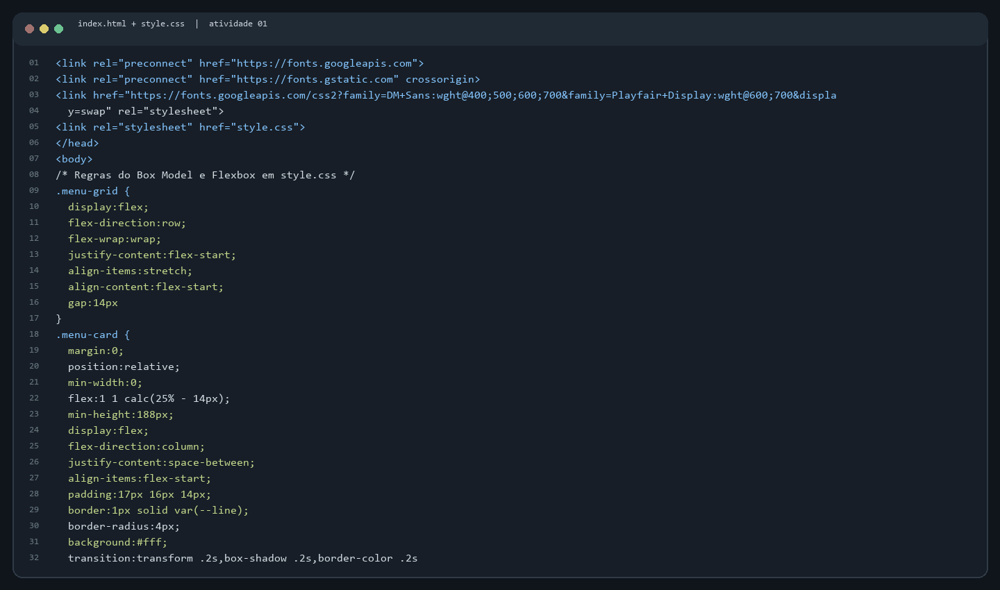
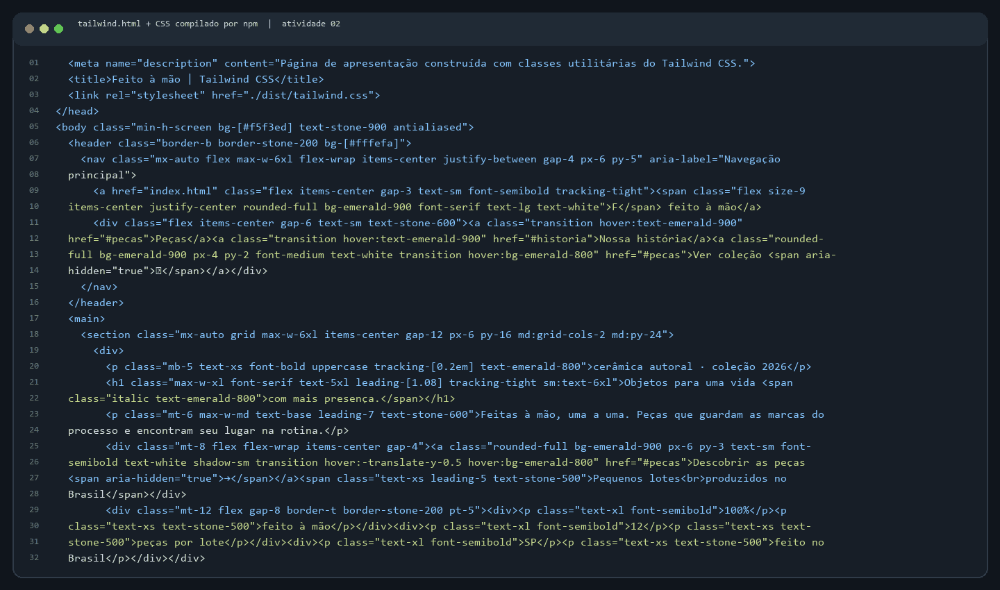

# Projeto: interfaces com CSS e Tailwind

Entrega das Atividades 01 e 02 da aula **Frameworks CSS**. O projeto reúne duas páginas responsivas da marca fictícia Café Aurora / Feito à Mão:

- [Atividade 01 — CSS externo, Box Model e Flexbox](./index.html)
- [Atividade 02 — Tailwind CSS](./tailwind.html)

## Como abrir

Instale as dependências e compile o CSS do Tailwind pelo npm:

```bash
npm install
npm run build
```

Depois, abra `index.html` em um navegador. Use o link **Projeto Tailwind** no menu para acessar a segunda página. O `tailwind.html` carrega o CSS compilado em `dist/tailwind.css`; o `style.css` da Atividade 01 também é carregado externamente com `<link rel="stylesheet">`. Para recompilar automaticamente durante alterações, use `npm run watch`.

## Atividade 01 — CSS, modelo de caixa e Flexbox

A página de cardápio tem 20 cartões de produtos. Cada cartão possui conteúdo, `padding`, `border` e `margin` explícitos no CSS. O CSS externo também define cores, dimensões, bordas e pontos de quebra para telas menores.

O layout usa mais de 20 declarações Flexbox distribuídas entre cabeçalho, navegação, hero, grade de produtos, cartões, seção final e rodapé. Exemplos do arquivo `style.css`:

| Declaração | Função na página |
|---|---|
| `display: flex` | Ativa o contexto Flexbox nos containers |
| `flex-direction: row` | Alinha navegação, ações e itens em linha |
| `flex-direction: column` | Empilha os elementos de marca e conteúdo dos cartões |
| `flex-wrap: wrap` | Permite que elementos passem para outra linha |
| `justify-content: space-between` | Distribui itens pelas extremidades do container |
| `justify-content: center` | Centraliza navegação, ícones e ilustração |
| `justify-content: flex-start` | Inicia a grade e a navegação pelo começo |
| `align-items: center` | Alinha itens pelo centro do eixo transversal |
| `align-items: flex-end` | Alinha a chamada da seção pelo rodapé |
| `align-items: stretch` | Faz cartões compartilharem a altura da linha |
| `align-content: flex-start` | Agrupa as linhas da grade no início do container |
| `gap` | Cria espaçamento consistente entre itens e linhas |
| `flex: 1 1 calc(25% - 14px)` | Define crescimento, redução e base dos cartões |
| `flex: 1 1 330px` | Permite que o texto do hero se ajuste ao espaço |
| `flex: 0 1 355px` | Limita a ilustração e permite sua redução |
| `flex: 1 1 auto` | Faz o conteúdo dos cartões ocupar o espaço disponível |
| `flex-basis: calc(50% - 8px)` | Exibe dois cartões por linha em telas pequenas |
| `flex-basis: 100%` | Empilha cartões nas telas mais estreitas |
| `flex-wrap: nowrap` | Mantém preço e etiqueta na mesma linha |
| `gap: 14px` | Separa os cartões da grade |

## Atividade 02 — Tailwind CSS

A página `tailwind.html` usa **207 classes distintas**, superando o mínimo de 30. A lista abaixo registra as classes usadas e sua função; variantes responsivas e de interação aparecem junto da classe que modificam.

| Grupo | Classes e função |
|---|---|
| Cores e fundos | `bg-[#f5f3ed]`, `bg-[#fffefa]`, `bg-white`, `bg-emerald-900`, `bg-gradient-to-br`, `text-stone-900`, `text-stone-600`, `text-emerald-800`, `text-white`, `from-[#d4ad80]`, `via-[#c59466]`, `to-[#a87953]` — aplicam fundos, gradientes e cores de texto. |
| Tipografia | `font-serif`, `font-semibold`, `font-bold`, `text-xs`, `text-sm`, `text-base`, `text-5xl`, `italic`, `uppercase`, `tracking-tight`, `tracking-[0.2em]`, `leading-7` — controlam família, peso, tamanho, estilo, caixa, espaçamento e altura de linha. |
| Espaçamento e dimensões | `mx-auto`, `max-w-6xl`, `max-w-xl`, `p-3`, `px-6`, `py-16`, `mt-8`, `mb-5`, `gap-4`, `size-9`, `h-48`, `w-56`, `min-h-screen`, `aspect-[4/3]` — definem largura, altura, margens, preenchimentos e intervalos. |
| Bordas e aparência | `border`, `border-stone-200`, `rounded-full`, `rounded-2xl`, `rounded-[2rem]`, `shadow-sm`, `shadow-xl`, `blur-md`, `overflow-hidden`, `transition` — estilizam limites, cantos, sombra, recorte e transições. |
| Posicionamento | `relative`, `absolute`, `top-6`, `right-8`, `bottom-8`, `z-10`, `rotate-6` — posicionam e empilham elementos decorativos. |
| Flexbox e grid | `flex`, `flex-wrap`, `items-center`, `items-end`, `justify-between`, `justify-center`, `grid`, `lg:grid-cols-3`, `inline-flex` — montam navegação, grupos de conteúdo e grade de peças. |
| Responsividade e interação | `sm:grid-cols-2`, `md:grid-cols-2`, `lg:grid-cols-3`, `md:py-24`, `hover:bg-emerald-800`, `hover:shadow-lg`, `group-hover:scale-105` — ajustam colunas e espaçamento por breakpoint e criam estados de interação. |

Para conferir o inventário completo das classes, veja os atributos `class` em `tailwind.html`.

## Capturas

### Código

Os prints abaixo mostram trechos reais dos arquivos-fonte usados nesta entrega.





### Aplicação em funcionamento

Abra as páginas no navegador para ver a aplicação funcionando: [cardápio CSS](./index.html) e [coleção Tailwind](./tailwind.html). O navegador confirmou o carregamento das duas páginas; a página Tailwind não apresentou erros de console.

As capturas de código estão incluídas acima. Não consegui salvar capturas de tela do navegador nesta sessão: o ambiente bloqueou a captura local em arquivo. As duas páginas foram abertas e conferidas no navegador.

## Link do projeto

O projeto está organizado no repositório da disciplina em [`aula-07/frameworks-css`](https://github.com/joaosouza73/frameworks-frontend-senai/tree/main/aula-07/frameworks-css). Abra [index.html](./index.html) para iniciar e [tailwind.html](./tailwind.html) para acessar a segunda atividade.
